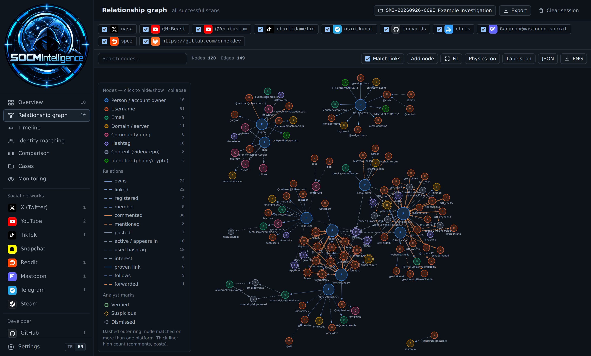

<p align="center">
  
</p>

<h1 align="center">SOCMIntelligence</h1>

<p align="center">
  <b>Multi-platform SOCMINT / OSINT web tool.</b><br>
  15 source modules, cross-platform identity graph, same-person scoring, case management and tamper-evident reports — in one FastAPI app that starts with a single command.
</p>

<p align="center">
  

</p>

<p align="center">
  
</p>

---

## What it is

SOCMIntelligence collects public data from many platforms, turns each result into **charts, finding tables and a relationship graph**, and merges everything into a single cross-platform identity graph. Because the same account gets the same node ID everywhere, an email, domain or username that shows up in two different scans is automatically linked — so you can see who is who across services.

## Modules

| Group | Modules |
|---|---|
| **Social networks** | X (Twitter) · Instagram · Bluesky · LinkedIn · YouTube · TikTok · Twitch · Kick · Snapchat · Reddit · Mastodon · Telegram · Discord · Steam |
| **Developer** | GitHub · GitLab · Stack Exchange · Hacker News |
| **Identity & archives** | Keybase · Gravatar · Wayback Machine |
| **Search & map** | Keyword search (Bluesky · Reddit · Mastodon) · Hashtag map |

Each module reads **public data only** (or an official API where a key is provided). There is no credential/session scraping of private accounts.

## Features

- **Relationship graph** — a D3 force graph that merges every successful scan. Cross-platform matches (shared email, domain, username), pivoting (double-click a node to scan it in the right module), search, type filters, PNG/JSON export.
- **Timeline** — every account's posts, comments, uploads and account-creation events on one axis, plus an hour-overlap heatmap and hour-similarity table.
- **Identity matching** — a 0–100 “same person?” score per account pair with reasons (verified/cryptographic link, shared email, username & display-name similarity, shared personal domain, avatar pHash, activity hours). Pairs ≥ 40 are drawn on the graph.
- **Comparison** — put 2+ scanned accounts of the same module side by side (KPI table + bar chart, highest value highlighted).
- **Analyst marks** — mark graph nodes Verified / Suspicious / Dismissed, add notes, add manual nodes and links. All saved to the case.
- **Case management** — create a case, activate it, and scans/marks/notes are saved automatically. Import/export a `.socmint` package.
- **Change tracking (Monitoring)** — rescan targets on a schedule and record what changed (fields, new/removed links).
- **Evidence integrity** — every scan's raw data is hashed (SHA-256 over canonical JSON) at collection time; a verify button proves whether it was altered.
- **Exports** — HTML / PDF report, Excel (.xlsx), GraphML (Gephi/yEd), GEXF (Gephi), Maltego CSV, JSON.
- **Bilingual UI** — Turkish / English toggle (default Turkish); reports, spreadsheets, chart labels, date & number formats all follow the selected language.
- **Settings page** — API keys, proxy / Tor / proxy-list rotation and rate limits, all managed from the UI instead of `.env`.

## Quick start

```bash
python3 -m venv .venv && source .venv/bin/activate
pip install -r requirements.txt
uvicorn server:app --host 0.0.0.0 --port 8000
```

Then open **http://localhost:8000** — API docs at `http://localhost:8000/docs`.

Next runs only need:

```bash
source .venv/bin/activate && uvicorn server:app --port 8000
```

Docker: `docker compose up --build` (single service).

## Configuration

All configuration lives on the **Settings** page (saved to `data/settings.json`; `.env` is still read, Settings wins):

- **API keys** — stored server-side, never returned to the browser (only “set” + last 4 chars are shown).
  - `YOUTUBE_API_KEY` — required for the YouTube module.
  - `X_BEARER_TOKEN` — X (Twitter) API v2. **Without it the X module shows clearly-labelled sample data** so you can preview the output before adding a token.
  - `STEAM_API_KEY`, `STACKEXCHANGE_KEY`, `GRAVATAR_API_KEY`, `GITLAB_TOKEN` — optional, unlock extra data.
- **Proxy / Tor** — off, Tor, a single custom proxy, or a **proxy list** that rotates round-robin per scan (spreads rate limits).
- **Rate** — parallel scan count and delay between requests.


## Notes

- **X (Twitter):** the free X plan is very limited — even with a token, post history may come back empty on some plans; the module labels that case.
- **Telegram** reads only the public `t.me/s/` preview (no login).
- **Gravatar** receives only the MD5/SHA-256 hash of an email, never the email itself.
- **TikTok** frequently rate-limits/bot-blocks; the module retries and distinguishes a real “not found” from a temporary block.
- Time distributions are UTC. TikTok follower “growth” is an estimate (marked as such), not real history.
- `backend/app/tools/youtube_osint.py` ships with a hardcoded fallback API key — replace it with your own from Settings and remove that line.

## License

Apache License 2.0 — see [LICENSE](LICENSE).
